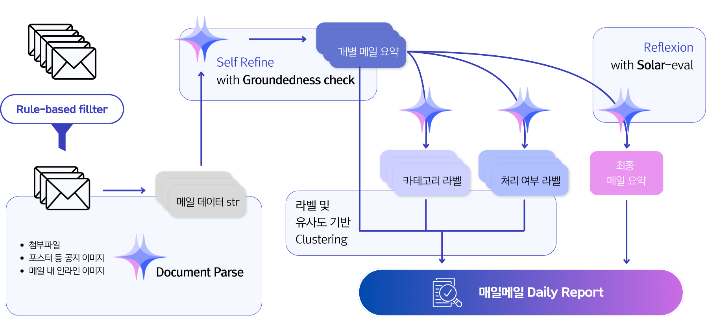

import Stacks from '../../containers/project/Stacks'
import MemberContainer from '../../containers/project/MemberContainer'
import MemberGrid from '../../containers/project/MemberGrid'
import { FontAwesomeIcon } from '@fortawesome/react-fontawesome'
import { faGithub } from '@fortawesome/free-brands-svg-icons'

TBD

<Stacks>
  
  
  
  
  

  
  

  
  
  

  

  
  
  
  
</Stacks>

  ## Metric

  ### 📝 개별 메일 요약

  | Condition              | ROUGE-1 Recall | ROUGE-1 Precision | ROUGE-1 F1 | BERT Score Recall | BERT Score Precision | BERT Score F1 | G-EVAL Conciseness |
  | ---------------------- | -------------- | ----------------- | ---------- | ----------------- | -------------------- | ------------- | ------------------ |
  | Baseline               | 0.0667         | 0.0042            | 0.1678     | 0.8223            | 0.8789               | 0.8494        | 4.3958             |
  | + refine               | 0.2618         | 0.2049            | 0.4649     | 0.8740            | 0.9146               | 0.8932        | 4.8750             |
  | + one-shot             | 0.2288         | 0.2005            | 0.3661     | 0.8325            | 0.8905               | 0.8588        | 4.9375             |
  | **+ refine, one-shot** | **0.3062**     | **0.2691**        | **0.4690** | **0.8905**        | **0.9319**           | **0.0901**    | **4.9167**         |

  `ROUGE-1`에서 **24.0 ~ 30.1%p**, `BERTScore`에서 **5.3 ~ 6.8%p**, `G-Eval conciseness` 항목(5점 만점)에서 **0.52점** 상승폭이 있었습니다.

   

  ### 🏷️ 메일 분류

  | Condition                | Accuracy   | Tokens     | Accuracy per Token |
  | ------------------------ | ---------- | ---------- | ------------------ |
  | Baseline                 | 0.8104     | 97,436     | 8.32e-6            |
  | **summary based**        | 0.7708     | **52,477** | **1.47e-5**        |
  | summary based + 1-shot   | 0.8021     | 63,599     | 1.27e-5            |
  | summary based + 5-shots  | 0.7708     | 86,878     | 8.87e-6            |
  | summary based + 10-shots | **0.8146** | 115,558    | 7.05e-6            |

  `정확도/토큰 사용량` 지표를 바탕으로 현재 프롬프트를 채택했습니다.

   

  ### 📜 최종 리포트

  | Condition                                                 | G-eval score |
  | --------------------------------------------------------- | ------------ |
  | Self-Refine: Baseline                                     | 3.75         |
  | Self-Refine: Detailed Instructions                        | 3.50         |
  | Self-Refine: Detailed Instructions + Formatting Penalty   | 3.94         |
  | Reflexion: Baseline                                       | 4.00         |
  | Reflexion: Detailed Instructions                          | 3.50         |
  | **Reflexion: Detailed Instructions + Formatting Penalty** | **4.19**     |

  `G-Eval` 평가 평균 점수(4.5점 만점)에서 **0.44점** 상승이 있었습니다.

## System Structure

## 🔗 둘러보기

- [전체 프로젝트 코드](https://github.com/jagaldol/maeilmail) <FontAwesomeIcon size="lg" icon={faGithub} />
- [사용된 프롬프트 모음](https://github.com/jagaldol/maeilmail/tree/main/prompt/template) 🗣️
- [크롬 익스텐션 FastAPI 서버 코드](https://github.com/jagaldol/maeilmail/tree/main/server) <FontAwesomeIcon size="lg" icon={faGithub} />
- [크롬 익스텐션 FastAPI API 문서](https://huggingface.co/devlim/Korea-HealthCare-RAFT-float16) 📜
- [크롬 익스텐션 코드](https://github.com/jagaldol/maeilmail/tree/main/chrome-extension) <FontAwesomeIcon size="lg" icon={faGithub} />

<MemberContainer>
  <MemberGrid members={[
    {
      imageSrc: 'https://github.com/jagaldol.png',
      link: 'https://github.com/jagaldol',
      name: '안혜준',
      description: '파이프라인 설계, Reflexion 구현, 서비스 개발, 코드 품질 관리'
    },
    {
      imageSrc: 'https://github.com/chell9999.png',
      link: 'https://github.com/chell9999',
      name: '이채호',
      description: 'Reflexion 구현 및 고도화, 최종 요약 G-eval 평가 고도화'
    },
    {
      imageSrc: 'https://github.com/Usunwoo.png',
      link: 'https://github.com/Usunwoo',
      name: '유선우',
      description: 'PM, 기획 및 디자인, 파이프라인 설계, 요약 및 분류 평가'
    },
    {
      imageSrc: 'https://github.com/gsgh3016.png',
      link: 'https://github.com/gsgh3016',
      name: '강감찬',
      description: 'Self-refine 및 클러스터링, 서비스 개발, 요약 및 분류 평가'
    },
    {
      imageSrc: 'https://github.com/canolayoo78.png',
      link: 'https://github.com/canolayoo78',
      name: '유채은',
      description: 'Gmail 데이터 파싱 및 Mail 객체 관리, 분류 파이프라인 구현'
    },
    {
      imageSrc: 'https://github.com/eyeol.png',
      link: 'https://github.com/eyeol',
      name: '단이열',
      description: '평가용 데이터셋 구성 및 제작, 평가 지표 설계, 페르소나 디자인'
    },
  ]} />
</MemberContainer>
