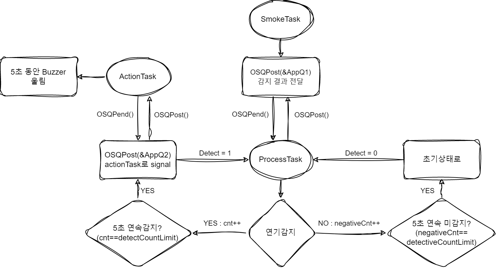

import Stacks from '../../containers/project/Stacks'
import MemberContainer from '../../containers/project/MemberContainer'
import MemberGrid from '../../containers/project/MemberGrid'

임베디드 시스템 과목에서 **2인 팀으로 진행한 Term Project**입니다.

금연구역으로 지정된 장소에서 흡연을 하는 사람들이 종종 발견됩니다. 하지만 흡연 장소의 특성상 지속적인 단속이 시행되기 어렵기 때문에 방지가 어렵습니다. Smoke Detector는 **흡연을 자동으로 감지하고 경보음을 울립니다**. 이를 통해 금연구역에서의 흡연을 지양시키고 흡연자가 자발적으로 금연구역을 준수하는 걸 목표로 합니다.

임베디드 보드 `NUCLEO-F429ZI`와 `연기 감지 센서`를 활용하여 프로젝트를 진행하었습니다. 일정 간격으로 **센서의 값을 읽고 `messageQueue`를 통해 값을 다른 `process`로 전달**합니다. 전달받은 값을 처리하여 흡연이 감지되면 부저를 울립니다.

> 0.5초 간격으로 연기를 감지하여 5초간 연기가 감지될 시 경고음이 울립니다.

<Stacks>
  
  
</Stacks>

## 🎞️ Demo

  <iframe width="560" height="315" src="https://www.youtube.com/embed/fxReEu6GE9A?si=RBYjzvBFZJgO17gR" title="YouTube video player" frameborder="0" allow="accelerometer; autoplay; clipboard-write; encrypted-media; gyroscope; picture-in-picture; web-share" allowfullscreen></iframe>

## 💭️️ 흐름도

  

  
  

## 환경
- Atollic TrueSTUDIO for STM32 9.3.0
- 개발보드 : NUCLEO-F429ZI

## 사용 센서 및 모듈
 - 연기 감지 센서 `MQ-2`
 - 능동부저모듈 `mh-fmd`

<MemberContainer>
  <MemberGrid members={[
    {
      imageSrc: 'https://github.com/jagaldol.png',
      link: 'https://github.com/jagaldol',
      name: '안혜준',
      description: '신호 처리 및 부저 동작 코드 작성'
    },
    {
      imageSrc: 'https://github.com/gogumac.png',
      link: 'https://github.com/gogumac',
      name: '김유빈',
      description: '센서 메시지 큐 전달 코드 작성'
    },
  ]} />
</MemberContainer>