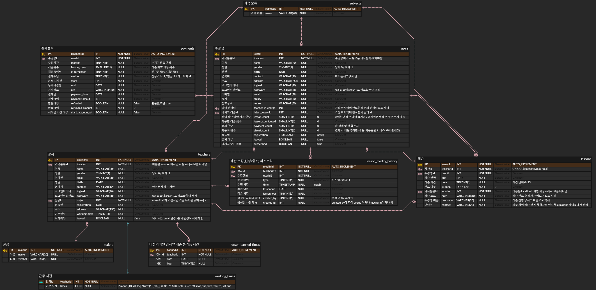
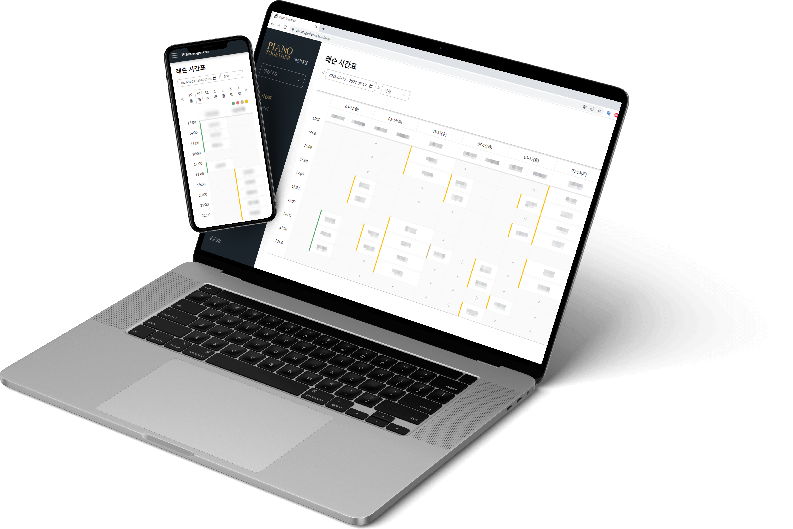

부산대/경성대 2개 지점을 운영 중인 피아노 학원, [Piano Together](https://pianotogether.co.kr)의 레슨 관리 시스템입니다.

- 웹 링크: [https://pianotogether.co.kr/admin](https://pianotogether.co.kr/admin)

## 👥 팀원

## 🔧 사용 기술

- Front-End - `React`
- Back-End  - `Node.js` `Express` `MySQL` `Apache`

## 🗄️️ ERD

## 🗒️ 주요 기능

- 수강생
  - 레슨 시간표 조회 및 예약/취소
  - 본인 레슨 목록 조회
  - 잔여 레슨 횟수 조회
  - 개인 정보 변경
- 관리자
  - 레슨 시간표 조회 및 강제 예약/취소
  - 수강생 관리
  - 수강생 등록/탈퇴
  - 수강생 검색 및 필터
  - 수강생 상세정보 조회
  - 결제 내역 조회 및 환불
  - 안내 문자 전송(레슨 알림, 재등록 알림)
  - 강사 관리
  - 강사 등록/퇴사
  - 강사 상세정보 조회
  - 강사 별 담당 학생 조회
  - 강사 출근 시간표 관리
  - 결제 정보 등록

실제 서비스 되고 있는 페이지(학원 수강생-mobile)

실제 서비스 되고 있는 화면(학원 관리자-pc)

## 🔗 링크

- https://pianotogether.co.kr/admin/
- 로그인이 필수인 페이지여서 자세한 내용은 [아래](https://www.notion.so/38cd8462261f4843abf4802d55e4435d?pvs=21)를 참고해주세요.

  
<h2 className="inline-block">🔍 상세 내용 보기</h2>

### DB 설계

간략화한 데이터베이스 형태

### 접속 및 로그인

로그인 화면

- https 보안 접속(`OpenSSL` 사용)
- CORS(Cross-Origin Resouce Sharing) 적용
- 세션 쿠키를 통한 로그인 정보 유지
- 패스워드 암호화 저장(SHA-512)

### 레슨 시간표

- 화면 생성
- 해당 날짜들에 출근하는 선생님들에 맞게 테이블 레이아웃 구성
- 해당 날짜들에 존재하는 레슨을 테이블에 추가
- 현재 시간 이후의 셀은 선생님 스케쥴에 맞춰 예약 가능함을 `+` 로 표시
- 주요 기능
- `+` 를 눌렀을 때 레슨 신규예약 모달 출력
- 예약된 셀을 눌렀을 때 레슨 상세 정보 모달 출력

(관리자 레슨 강제 취소/ 완료 처리 가능)

- 레슨 상태는 초/빨/갈/노 색으로 구분
- **더 보기**

레슨 상세 정보 모달(관리자) - 레슨 완료와 레슨 취소가 가능

DatePicker와 선생님 선택 기능

선생님 날짜 별 레슨 불가 시간 선택(관리자)

좌측 네비게이션 바에서 타 지점 확인(관리자)

### 수강생 관리(관리자)

- 수강생 필터(현재 수강생, 레슨 전날 대상자, 생일자 등)
- 수강생 검색(이름, 생일, 전화번호)
- 수강생 등록
- 수강생 정보 상세보기
- 수강생 탈퇴 처리
- 비밀번호 재설정
- 수강생 정보 수정
- 수강생 별 레슨 내역 확인
- 수강생 별 결제 내역 확인
- **더 보기**

수강생 등록 창 - 잘못된 입력으로 등록버튼 누른 경우

상세보기 창

비밀번호 재설정

레슨 목록

레슨 예약/취소 내역

결제 내역

### 문자 전송

[수강생 관리](https://www.notion.so/38cd8462261f4843abf4802d55e4435d?pvs=21) → 수강생 목록 체크 → 문자 전송 버튼

`cafe24 문자 전송 api`를 사용하였습니다.

- 받는 사람 지정
- 체크 박스 리스트(수강생 번호를 index로 가지는 Map)로 기본 지정
- 수강생 검색으로 추가
- 전화번호 추가(수강생 외에도 문자 전송 가능)
- 레슨 전날 확인 문자
- 레슨 전날 대상자 filter에서 진입
- 지정된 레슨 확인 문구 발송
- 재등록 일주일 전 문자
- 재등록 일주일 전 filter에서 진입
- 지정된 재등록 기간 안내 문구 발송
- **더 보기**

레슨 전날 확인 문자 전송

재등록 일주일 전 문자 전송

### 강사 관리

- 강사 시간표 관리(출근 시간대 설정)
- 강사 등록
- 강사 정보 상세보기
- 퇴사 처리
- 비밀번호 재설정
- 강사 정보 수정
- 기간 내 강사 별 레슨 통계
- 재등록률(담당 학생이 다시 등록했는지)
- 레슨 횟수(예약된 레슨 횟수와 레슨 완료 횟수)
- 강사 별 담당학생 확인
- **더 보기**

출근 시간-레슨 예약 가능 시간(흰색)

강사 등록

강사 별 상세 정보

강사 별 담당 학생 목록

### 결제 정보 등록

결제 내역을 데이터베이스에 등록

### 모바일 환경

`react-responsive` 를 활용하여 화면 크기에 따른 반응형 디자인 구성

로그인 화면

레슨 시간표

레슨 예약

네비게이션

내 정보 수정

내 레슨 내역

---

## 배포 및 운영

- `React app`을 번들링하여 `Apache`로 웹 페이지 배포
- https 보안 접속(`OpenSSL` 사용)
- `Express`로 백엔드 서버 구동(`Apache`와 `CORS` 허용을 통한 연결)
- api call log 기록(`tracer` 라이브러리 사용)

## 👨🏻‍💻 담당 기능

*개발자 친구와 함께 매일 소통하며 작업 구간에 대한 구분 없이 제작하였기에 담당한 부분이 명확하게 나눠지지 않았습니다. 아래는 일정 이상 관여한 내용에 대하여 작성하였습니다.*

- 직접 맡은 부분
  - 관리자 전용 rest api 설계 및 작성
  - 수강생 관리 페이지 구현
  - 문자 전송 기능 구현
- 일정 이상 참여한 부분
  - 강사 관리 페이지 구현
  - 모바일에 대응한 반응형 화면 구성
  - 화면 디자인
- 기타 전반적인 버그 수정 및 리팩토링, 모듈화
- 유지보수 관리(3. 1. ~ )