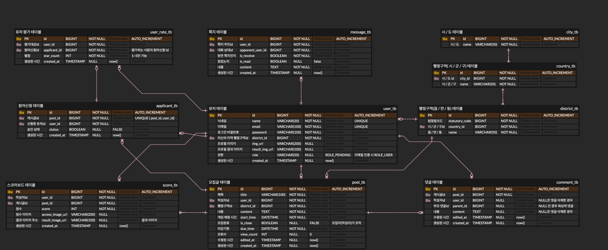

import Stacks from '../../containers/project/Stacks'
import MemberContainer from '../../containers/project/MemberContainer'
import MemberGrid from '../../containers/project/MemberGrid'
import { FontAwesomeIcon } from '@fortawesome/react-fontawesome'
import { faGithub } from '@fortawesome/free-brands-svg-icons'

카카오 테크 캠퍼스에서 진행한 4월부터 11월까지 7개월간의 교육 끝의 최종 팀 프로젝트 결과물입니다. 프론트엔드 2인, 백엔드 4인의 팀으로 기획부터 개발, 배포까지 모든 과정을 수행하였고, **카카오 테크 캠퍼스 최종 심사에서 우수 조로 선발**되어 상을 받게 되었습니다.

번개볼링은 **번개 지향 볼링 모집 커뮤니티**입니다. 일종의 커뮤니티이자 사용자간의 `모집글 작성` 및 `신청/수락`, `게임 기록 관리`(점수 등록, 유저 별점 평가) 등 **볼링에 특화된 다양한 편의 기능을 제공**합니다.

저는 **풀스택 개발**의 경험이 있었던 만큼 프론트엔드 개발자가 사용하기 편한 api를 설계하기 위해 노력했습니다. 데이터를 객체 단위로 담아 응답 데이터를 순회하며 렌더링만 하면 되도록 **데이터 구조에 신경**을 썼습니다. 또한, 풀스택 경험으로 인해 문제가 발생했을 때 프론트의 상황을 파악하기가 쉬웠고 백엔드의 상황과 종합하여 팀원간의 소통을 쉽게 풀어 나갈 수 있었습니다.

**직접 맡은 부분**은 회원가입/로그인으로 대표되는 `인증관련 api`들과 `행정구역 api`, `댓글 api`, `swagger`입니다. 초반 spring boot 프로젝트 세팅을 하며 spring security filter 또한 설정을 하게 되었고, 자연스럽게 security를 비롯한 인증, jwt 토큰, 권한 등의 api들 담당하게 되었습니다. 댓글의 경우 대댓글이 가능하도록 구현하였고, 댓글이 삭제된 경우에도 해당 댓글의 대댓글은 남아 있도록 신경을 썼습니다. **모든 api에 대해 통합 테스트 코드를 작성**하였고 `swagger-ui`로 [api 문서](https://server.jagaldol.com/api/docs/swagger)를 배포하였습니다.

또한, 협업에 있어 `github`의 기능을 적극 활용하였습니다. `issue`, `pr template`을 통해 통일된 양식을 강제하였고, `branch rule`을 사용해 `코드 리뷰`를 필수로 받아야 merge 가능하게 하였습니다. 추가적으로 `github action`을 통해 기초적인 `CI/CD`를 구축하여 팀원들이 온전히 개발에 집중할 수 있는 환경을 구축하였습니다.

<Stacks>
  
  
  
  

  
  
  
  
  

  
  
  
  
</Stacks>

## 🗄️️ ERD



## System Structure

### 전체 구성도

<div className={"flex justify-center w-full"}>
  <div className={"max-w-[1000px]"}>
    
  </div>
</div>


### 백엔드 구성도

<div className={"flex justify-center w-full"}>
  <div className={"max-w-[1000px]"}>
    
  </div>
</div>


> 카테캠 과정 중 카카오 크램폴린을 통해 배포를 하였습니다.
>
> 크램폴린 내부에서 SMTP를 사용할 수 없어 별도의 SMTP 서버로 분리하였습니다.

<details>
  <summary><h2 className="inline-block">FEATURES</h2></summary>

  ### 인증

  JWT를 이용하였습니다.

  - ACCESS TOKEN과 REFRESH TOKEN을 구현하였으며 REFRESH TOKEN은 REDIS에 저장됩니다.
  - RTR(refresh token rotation) 전략으로 리프레시를 일회용으로 사용하였습니다.
  - ACCESS 토큰은 AUTHORIZATION 헤더로 BEARER 토큰으로 전달합니다.
  - REFRESH 토큰은 HTTP-ONLY 쿠키로 전달하여 클라이언트의 접근을 막아 보안성을 강화하였습니다.
  - 회원가입 시, 유저 권한을 바로 부여하지 않고 이메일인증을 필요하게 하여 보안성, 안정성을 강화하였습니다.

  **회원가입을 하지 않은 유저는 아래의 기능만 사용이 가능합니다.(주로 조회만 가능)**

  - 행정구역 관련 기능
  - 모집글 조회
  - 댓글 조회
  - 사용자 조회 (유저 기록 조회, 참여 기록 조회, 점수 조회)

  **회원가입을 한 유저는 아래의 기능을 추가로 사용할 수 있습니다.**

  - 자신의 회원정보 조회 및 수정
  - 쪽지 조회

  **회원 가입 후 이메일인증을 받은 유저는 아래의 기능을 포함하여 모든 기능을 사용할 수 있습니다.**

  - 모집글 관련 모든 기능
  - 신청 관련 모든 기능
  - 댓글 관련 모든 기능
  - 쪽지 관련 모든 기능
  - 별점 등록, 점수 등록 기능

  ### 메일 전송

  현재 SMTP 서버는 분리되어, Naver Cloud 상에서 배포 중입니다.

  #### Flask 사용 이유

  크램폴린 환경에서는 카카오 정책으로 인해 HTTP 통신만 가능하다는 프로토콜 통신 제한이 있어, 외부에 SMTP 서버를 구축하여 SMTP 이메일 전송을 구현하기로 하였습니다. POST 요청에 의한 이메일 발송만 구현하면 되었기에 간결하면서도 필요한 기능을 구현할 수 있는 도구를 선택하려고 하였고, 이에 간결하게 사용할 수 있는 웹 Framework인 Flask로 메일 전송 요청에 따른 메일 전송 기능을 구현하게 되었습니다.

  #### SMTP 서버 구조 설명

  크램폴린 환경에서만 Naver Cloud 환경에서의 flask 서버를 활용합니다.

  **HTTP POST 요청 생성하기**

  - SpringBoot 상에서 Flask로 보내게 될 HTTP 요청에 대한 request를 생성하기 위해 MultiValueMap을 이용하여 request body를 생성합니다.
  - HTTP Header와 requestURL을 설정하고, Proxy 설정이 된 RestTemplate을 이용하여 HTTP 통신을 통해 Flask 서버로 POST 요청을 전송합니다.

  **SMTP 요청 생성하기**

  - HTTP POST 요청이 들어오면, Flask 서버는 SMTP 서버로 보내게 될 SMTP 요청을 생성합니다.
  - request body에서 필요한 정보를 추출하고, SMTP 요청을 생성합니다. 이때, SMTP의 text 부분에 들어갈 내용이 html이므로, MIME Type을 text/html으로 설정해야 요청이 정상적으로 보내집니다.
  - SMTP 권한 설정한 후, 발신자와 수신자 그리고 text를 설정하여 SMTP 서버로 요청을 보냅니다.
  - 요청이 성공적으로 전송되면 200을 반환합니다.

  ### 행정 구역

  정부의 행정구역 데이터를 db에 미리 작성해두어 행정구역 데이터를 직접 관리하도록 구현하였습니다.

  > [행정표준코드관리 시스템 - 법정동코드 목록 조회](https://www.code.go.kr/stdcode/regCodeL.do) 데이터 파일을 이용하여 sql 데이터를 생성하였습니다.

  ### 모집글

  볼링 번개 모임을 모집하려는 사람이 작성하는 포스팅입니다.

  - 모집글을 등록하면, 타 유저들이 해당 모집글에 신청을 할 수 있고, 모임을 결성할 수 있습니다.
  - 참가희망자들은 참가신청 기능을 이용하여 참가신청을 할 수 있고, 모집글 게시자가 참가수락 여부를 결정할 수 있습니다.
  - 댓글 기능이 있어 정보 교환 및 소통이 가능합니다.
  - 이후 모집글을 베이스로 참여기록, 별점, 점수등록 등이 이루어 지기 때문에모임 확정 이후에는 모집글 내용을 수정하거나 삭제할 수 없습니다.

  #### JPA Specification

  모집글 데이터가 필요한 API를 구현하는 도중, 복잡한 조건처리가 필요한 로직이 있어 동적 쿼리가 필요했습니다. `queryDSL`을 학습하여 도입하기에는 프로젝트 기간이 한정적이라 비교적 사용이 쉬운 JPA Specification을 사용하였습니다.

  - 참여기록 데이터에 적용된 `JPA Specification`의 일부 로직입니다.

  ```java
  private List<Post> loadPosts(CursorRequest cursorRequest, Long userId, String condition, String status, Long cityId, String start, String end) {
  int size = cursorRequest.hasSize() ? cursorRequest.size() : DEFAULT_SIZE;
  Pageable pageable = PageRequest.of(0, size, Sort.by(Sort.Order.desc("id")));

  Specification<Post> spec = Specification.where(conditionEqual(condition, userId))
      .and(statusEqual(status))
      .and(cityIdEqual(cityId))
      .and(createdAtBetween(start, end));

  if (cursorRequest.hasKey()) {
      spec = spec.and(postIdLessThan(cursorRequest.key()));
  }
      return postRepository.findAll(spec, pageable).getContent();
  }
  ```

  > 해당 부분에서 동적쿼리를 사용하지 않으면 30개가 넘는 조건을 처리해야 했기 때문에 `JPA Specification`을 도입하게 되었습니다.

  ### 댓글

  댓글에 대댓글을 달 수 있도록 설계하였습니다.

  - 조회는 비회원도 가능하지만 작성은 회원만 가능합니다.
  - 커서 기반 페이징을 하였습니다.
  - 삭제된 댓글에 대댓글이 있는 경우 대댓글 표시를 위해 전달이 됩니다.

  - 삭제된 댓글이 표시될 경우 아래와 같이 표시됩니다.
  - `content: "삭제된 댓글입니다"`
  - `userId: null`

  - 그외, 대댓글이 없는 삭제된 댓글과 대댓글이 삭제된 경우의 댓글은 responseBody에 포함되지 않습니다.

  > 삭제된 댓글들로 인한 통일되지 않은 응답 개수 문제가 존재합니다.
  >
  > 이는 프론트의 구현이 무한 스크롤로 이루어 지기 때문에 적은 개수가 응답되어도 자동으로 다음 key로 요청이 일어나 사용자 경험에 큰 영향을 주지 않을 것으로 판단되어 이렇게 구현하였습니다.

  ### 신청, 별점

  모집글 작성자 이외의 유저들은 모집글에 참여 신청을 할 수 있습니다.

  - 작성자는 신청을 수락하거나 거부할 수 있습니다.
  - 작성자는 신청자 목록, 신청수락완료 유저을 확인할 수 있습니다.
  - 모임 시간 이후 사용자들은 별점 등록 API를 통해 참여자들에게 별점을 줄 수 있습니다.
  - 별점은 사용자의 평점에 영향을 줍니다.

  ### 볼링 점수(스코어)

  모임 이후, 해당 모임에 대해 점수를 등록할 수 있습니다.

  - 점수와 함께 이미지를 등록 할 수 있어 점수에 대한 증명이 가능합니다.
  - 모임 별 점수 등록은 여러개가 가능합니다.

  #### 이미지 등록

  외부 저장소 - `AWS S3`를 사용하였습니다.

  - white listing 방식으로 확장자 검사가 이루어 집니다.
  - 업로드 가능한 확장자는 png, jpg, jpeg, gif 4가지입니다.
  - 이미지의 사이즈는 10MB로 제한하였습니다.

  ### 프로필, 정보

  닉네임, 이메일, 지역 정보, 매너 점수, 볼링 Avergae 점수 등을 사용자 정보로 관리합니다.

  - 타인의 프로필 조회 시 얻을 수 있는 정보
  - 닉네임
  - 매칭기록에 기반한 볼링 Average점수
  - 매너 점수
  - 지역
  - 프로필 사진
  - 자신의 프로필 조회 시 추가로 얻을 수 있는 정보
  - id(PK)
  - 이메일
  - 메일인증여부

  ### 쪽지

  다른 사용자와 1대1 대화를 할 수 있습니다.

  - 카카오톡과 같은 채팅 서비스와 비슷한 사용자경험을 주기 위해 채팅 서비스와 유사하게 구현하였습니다.
  - 웹소켓을 이용한 채팅 기능으로의 변경을 염두에 두고 구현하였습니다.
</details>

## 🔗 둘러보기

- Swagger: [https://server.jagaldol.com/api/docs/swagger](https://server.jagaldol.com/api/docs/swagger)
- github: [https://github.com/Step3-kakao-tech-campus/Team3_BE](https://github.com/Step3-kakao-tech-campus/Team3_BE) <FontAwesomeIcon size="lg" icon={faGithub} />

<MemberContainer>
  <h3 className="text-center">Backend</h3>
  <MemberGrid members={[
    {
      imageSrc: 'https://github.com/sososo0.png',
      link: 'https://github.com/sososo0',
      name: '박소현/조장',
      description: '모집글, 점수 기록 api 담당'
    },
    {
      imageSrc: 'https://github.com/jagaldol.png',
      link: 'https://github.com/jagaldol',
      name: '안혜준/테크리더',
      description: '인증(계정), 댓글 api 담당'
    },
    {
      imageSrc: 'https://github.com/xcelxlorx.png',
      link: 'https://github.com/xcelxlorx',
      name: '김기해/기획리더',
      description: '신청, 참여 기록 api 담당'
    },
    {
      imageSrc: 'https://github.com/yunzae.png',
      link: 'https://github.com/yunzae',
      name: '김윤재/리액셔너',
      description: '행정구역, 쪽지 api 담당'
    }
  ]} />
  <div className="mt-20">
    <h3 className="text-center">Frontend</h3>
  </div>
  <MemberGrid members={[
    {
      imageSrc: 'https://github.com/kjh302903.png',
      link: 'https://github.com/kjh302903',
      name: '강주호/리마인더',
      description: '프론트 페이지 개발'
    },
    {
      imageSrc: 'https://github.com/Heo-Donghyuk.png',
      link: 'https://github.com/Heo-Donghyuk',
      name: '허동혁/타임키퍼',
      description: '프론트 페이지 개발'
    }
  ]} />
</MemberContainer>
