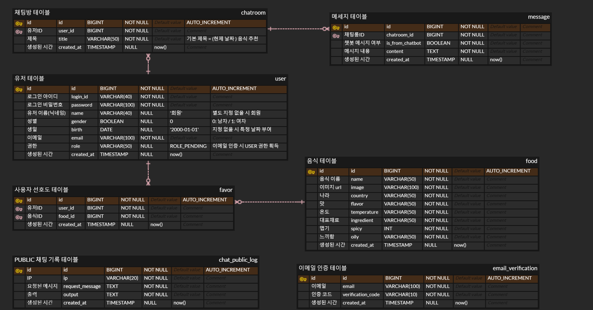
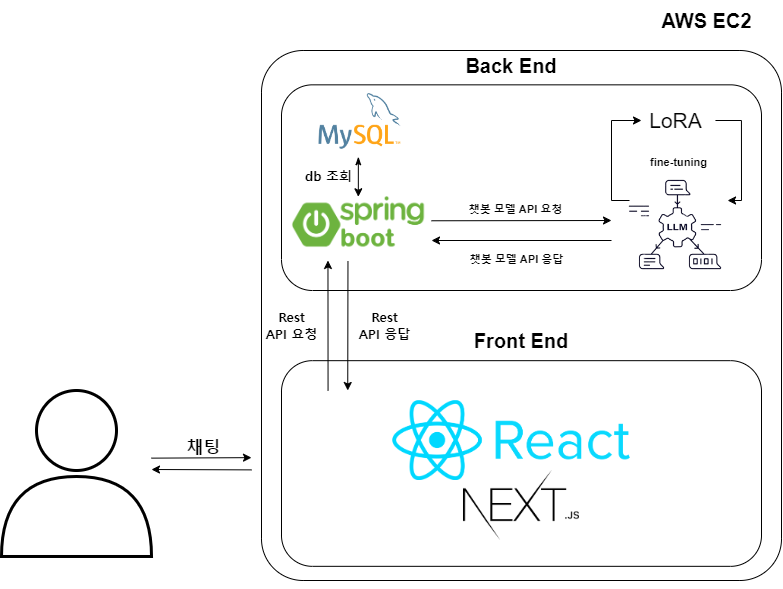

import Stacks from '../../containers/project/Stacks'
import MemberContainer from '../../containers/project/MemberContainer'
import MemberGrid from '../../containers/project/MemberGrid'
import { FontAwesomeIcon } from '@fortawesome/react-fontawesome'
import { faGithub } from '@fortawesome/free-brands-svg-icons'

LLM(Large Language Model)을 파인튜닝한 **음식 추천을 위한 챗봇 서비스**입니다.

푸디 AI는 `KoAlpaca-polyglot-5.8B의 베이스 모델` 위에서 `fine-tuning(LoRA)`을 거쳐 만들어졌습니다. SNS 대화 데이터(AI hub)와 Wikipedia의 음식 정보를 바탕으로 **GPT를 사용한 self-instruct**를 수행하였고 최종 `8,000개의 학습 데이터`를 이용하였습니다.

프로젝트 리더로써 동기들과 3인 팀을 결성하여 Local LLM 챗봇 웹 서비스를 만들었습니다. 개인적으로 AI, 특히 언어 모델들에 관심이 많았고 직접 ChatGPT와 같은 서비스를 만들어보고 싶었습니다. 졸업과제를 기회로 삼아 AI에 관심이 있는 동기들과 팀을 만들었고 챗푸디를 만들게 되었습니다. 3인 팀 중 웹 개발을 해본 사람이 저 밖에 없는 상황이였습니다. 프로젝트 진행에 앞서 팀원들에게 개발 프레임워크들을 가르쳤습니다.  막 웹 개발을 배운 팀원들의 코드는 코드 리뷰를 통해 모든 코드를 저를 거쳐 병합되도록 하였습니다.

chatGPT로 LLM이 유명해지기 시작하던 시기여서 언어 모델 파인튜닝에 대한 한국어 자료가 적어 주로 github의 오픈 소스들(`text-generation-webui`, `fastchat`, `nanoGPT`, `llama.cpp` 등)을 참고하여 학습하였습니다. 이 과정에서 모르는 기술에 대한 자신감을 얻을 수 있었습니다.

회원들의 `정보 관리`, `채팅방`, `채팅내역 관리`, `채팅 전송`과 `챗봇 응답에 대한 전처리/후처리`를 하는 **spring boot 서버를 개발**하였습니다. `server side rendering`을 간편하게 적용하기 위해 **Next.js를 사용하여 프론트 화면을 개발**하였습니다. 개발은 `typescript`를 사용하였고, 프로젝트 협업을 편하게 하기 위해 `eslint(airbnb)`, `prettier`를 적용하였습니다. **제가 담당한 부분**은 프로젝트의 전체적인 `구조 설계`와 `뼈대 구축`, `spring security`, `db 연결`, `웹소켓 api` 등을, UI 작업에서는 `채팅 UI`, `실시간으로 출력되는 AI의 대답 렌더링` 등 입니다.

> **현재 chatfoodie.net 도메인을 통해 배포**되고 있으며, 구글과 네이버 검색엔진에 등록되어있습니다.
>
> 2023년부산대학교 정보컴퓨터공학부 졸업과제

 

  
<b>⚠️ 현재 chatbot AI server는 비용 상의 문제로 실행되고 있지 않습니다. 체험을 위해서는 <a href="mailto:jagaldol.dev@gmail.com">이메일 문의</a> 부탁드립니다.</b>

<Stacks>
  
  
  
  
  
  
  
  
  
  
  
</Stacks>

  ## 📋 최종 보고서 확인하기

  <a href="/files/2023전기_최종보고서_41_쩝쩝학사_LLM(Large Language Model)을 사용한 AI 챗봇 연구.pdf">2023전기_최종보고서_41_쩝쩝학사_LLM(Large Language Model)을 사용한 AI 챗봇 연구.pdf</a>

## 🗄️️ ERD

## System Structure

## 🔗 둘러보기

- [서비스 전체 코드](https://github.com/jagaldol/chat-foodie) <FontAwesomeIcon size="lg" icon={faGithub} />
- [AI 챗봇 웹소켓 API 서버](https://github.com/jagaldol/chat-foodie-chatbot-server) <FontAwesomeIcon size="lg" icon={faGithub} />
- [챗봇 학습 데이터 세트 8,000개](https://huggingface.co/datasets/jagaldol/chat-foodie)
- [챗봇 LoRA 모델](https://huggingface.co/sm136599/chatfoodie-koalpaca-polyglot-5_8b-5150step-8batch_5epoch)
- [푸디 AI QLoRA 파인튜닝 예제](https://colab.research.google.com/github/jagaldol/chat-foodie/blob/main/chatbot/Deploy_chatbot_server_as_public_with_colab.ipynb)
- [코랩을 사용한 챗봇 websocket api 배포 예제](https://colab.research.google.com/github/jagaldol/chat-foodie/blob/main/chatbot/Deploy_chatbot_server_as_public_with_colab.ipynb)

<MemberContainer>
  <MemberGrid members={[
    {
      imageSrc: 'https://github.com/jagaldol.png',
      link: 'https://github.com/jagaldol',
      name: '안혜준(팀장)',
      description: '시스템 설계, 백엔드 및 프론트 개발'
    },
    {
      imageSrc: 'https://github.com/sm136599.png',
      link: 'https://github.com/sm136599',
      name: '박성민',
      description: 'AI 모델 학습, 백엔드 및 프론트 개발'
    },
    {
      imageSrc: 'https://github.com/icarus012832.png',
      link: 'https://github.com/icarus012832',
      name: '박진영',
      description: '서비스 UI 디자인, 백엔드 및 프론트 개발'
    }
  ]} />
</MemberContainer>