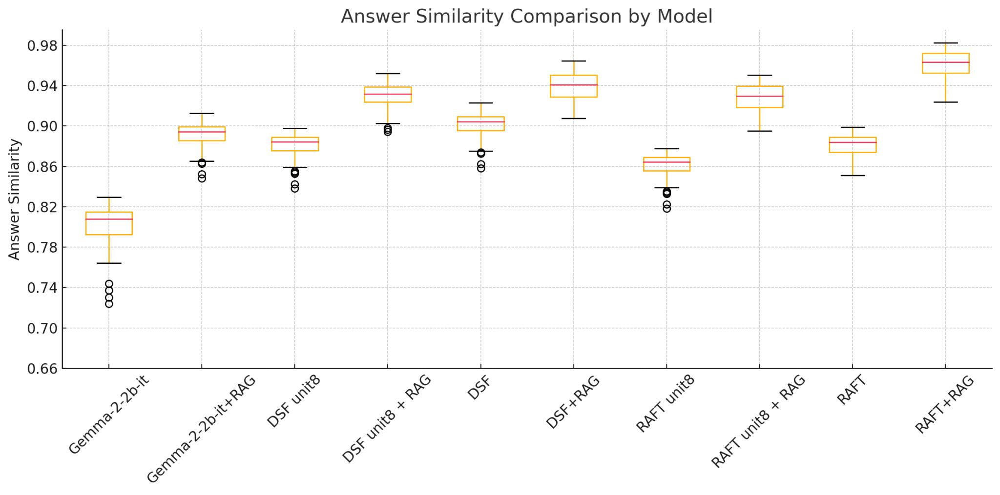
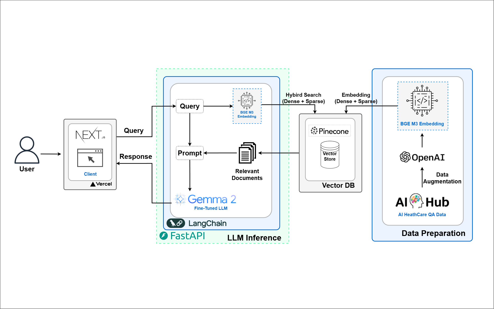

import Stacks from '../../containers/project/Stacks'
import MemberContainer from '../../containers/project/MemberContainer'
import MemberGrid from '../../containers/project/MemberGrid'
import { FontAwesomeIcon } from '@fortawesome/react-fontawesome'
import { faGithub } from '@fortawesome/free-brands-svg-icons'

Undoc은 `Gemma-2-2b-it` 베이스 모델에 **RAG**와 **RAFT** 기법을 적용해 개발된 **의료 상담 챗봇**입니다. **RAG** 기반의 하이브리드 검색 기법을 통해 의료 질의 응답 데이터를 효과적으로 검색하며, **RAFT**는 불완전한 검색 결과에 대한 강건성을 높이는 역할을 합니다. 이 모델은 초거대 `AI 헬스 케어 질의응답 데이터`을 활용하여 학습되었으며, **96.02%의 평균 응답 유사도**를 기록하며 기존 모델 대비 **16% 성능 향상**을 달성했습니다.

**RAG**의 하이브리드 검색 기법은 관련 문서 검색에서 높은 일관성을 보여, 다양한 질의에 대한 응답을 더욱 정확하게 제공합니다. 다만, 본 연구에 사용된 데이터셋이 특정 질문 유형에 초점이 맞춰져 있어, 더 다양한 의료 질의에 대한 성능을 보장하기 위해서는 추가적인 데이터 확장이 필요합니다.

추가적으로, 저는 `LangChain`을 사용해 **RAFT** 및 **RAG** 시스템을 설계하고, `FastAPI` 기반의 **LLM 추론 서버 개발**을 구축했습니다. 또한, 검색된 문서와 질의에 기반한 응답 생성을 위해 `pinecone`을 이용한 임베딩 및 하이브리드 검색을 구현했습니다.

이번 연구에서는 의료 전문가 대신 언어 모델을 사용해 응답을 평가했기 때문에, 임상적인 정확성을 완전히 반영하지 못한 한계가 존재합니다. 이를 보완하기 위해, 의료 전문가가 참여해 응답의 정확성을 평가할 필요가 있습니다.

> 구글 ML 부트캠프 5기 우수 프로젝트 선정

<Stacks>
  
  
  
  
  
  
  
  
  
  
  
  
</Stacks>

  ## Metric

  

    
  

   

  | Model             |   Median |
  |:------------------|---------:|
  | Gemma-2-2b-it     |     0.80 |
  | Gemma-2-2b-it+RAG |     0.89 |
  | DSF unit8         |     0.88 |
  | DSF unit8 + RAG   |     0.93 |
  | DSF               |     0.90 |
  | DSF + RAG         |     0.94 |
  | RAFT unit8        |     0.86 |
  | RAFT unit8 + RAG  |     0.93 |
  | RAFT              |     0.88 |
  | **RAFT + RAG**    | **0.96** |

## System Structure

## 🔗 둘러보기

- [RAG + RAFT AI 모델 코드](https://github.com/jagaldol/health-care-advisor) <FontAwesomeIcon size="lg" icon={faGithub} />
- [프론트엔드 코드](https://github.com/jagaldol/undoc) <FontAwesomeIcon size="lg" icon={faGithub} />
- [RAFT 파인튜닝 모델🤗](https://huggingface.co/devlim/Korea-HealthCare-RAFT-float16)
- [AI Hub 초거대 AI 헬스케어 질의응답 데이터](https://aihub.or.kr/aihubdata/data/view.do?currMenu=115&topMenu=100&dataSetSn=71762)
- [RAFT 및 DSF 파인튜닝 예제](https://colab.research.google.com/github/jagaldol/health-care-advisor/blob/main/notebooks/Gemma-QLoRA-RAFT_DSF.ipynb)

<MemberContainer>
  <MemberGrid members={[
    {
      imageSrc: 'https://github.com/jagaldol.png',
      link: 'https://github.com/jagaldol',
      name: '안혜준',
      description: 'RAFT, 및 RAG 시스템(LangChain) 및 서비스 개발'
    },
    {
      imageSrc: 'https://github.com/Lim-YoungYoon.png',
      link: 'https://github.com/Lim-YoungYoon',
      name: '임영윤',
      description: '데이터 수집 및 전처리, pinecone 임베딩'
    },
  ]} />
</MemberContainer>