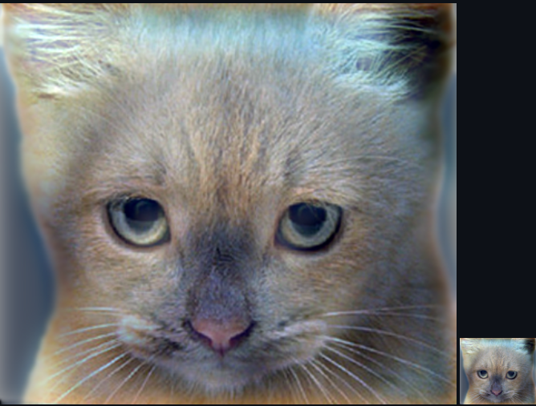
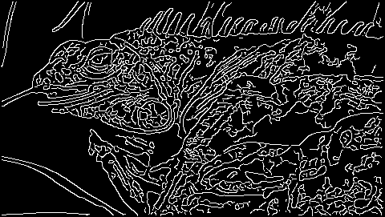
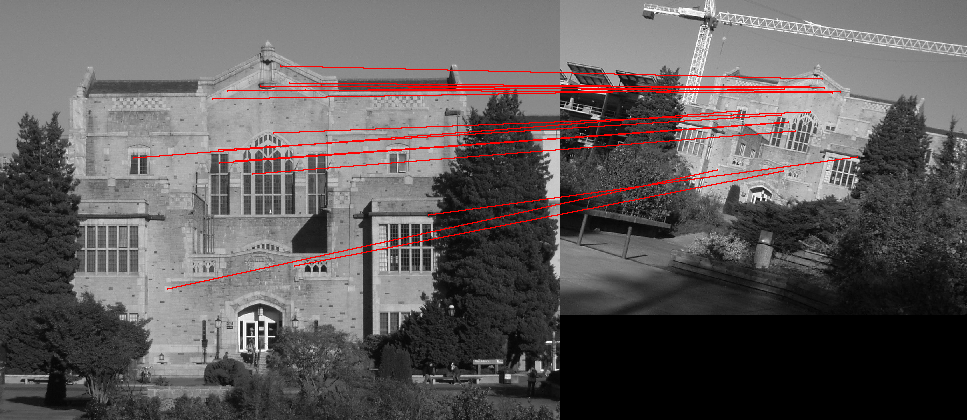
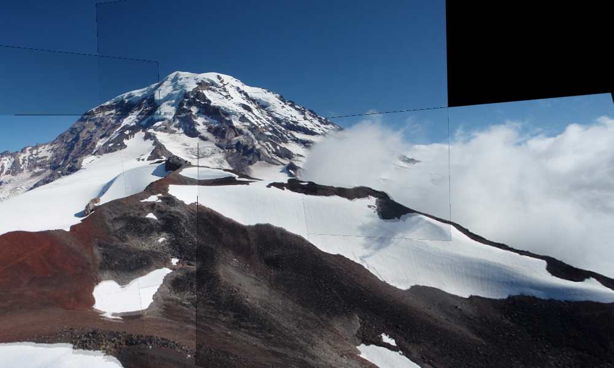
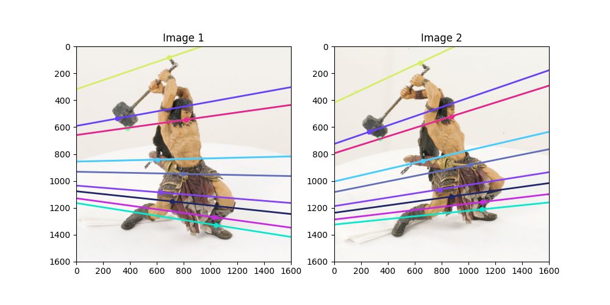

컴퓨터비전개론 강의에서 배운 점들을 실습 내역을 정리하였습니다. 실습들을 진행하며 **단순히 `OpenCV` 같은 라이브러리를 사용하는 것이 아닌, 기본적인 비전 처리를 `Python`을 통해 직접 구현**하였습니다. 구현한 내용은 `Gaussian Filter`, `Canny Edge Detection`, `RANSAC`, `Homography` `Epipolar Geometry`, `CNN` 등이 있습니다. 각 폴더 별로 코드와 함께 간략한 원리를 작성하였습니다.

> 부산대학교 2023년 컴퓨터비전개론을 정리한 [저장소](https://github.com/jagaldol/computer-vision)입니다.

  ## Contents

  [Image Processing with PIL](https://github.com/jagaldol/computer-vision-4-1/tree/main/1.%20image%20processing%20with%20PIL)

  

  [gaussian filter and hybrid image](https://github.com/jagaldol/computer-vision-4-1/tree/main/2.%20gaussian%20filter%20and%20hybrid%20image)

  

  [canny edge detection](https://github.com/jagaldol/computer-vision-4-1/tree/main/3.%20canny%20edge%20detection)

  

  [RANSAC](https://github.com/jagaldol/computer-vision-4-1/tree/main/4.%20RANSAC)

  

  [Panorama Stitching](https://github.com/jagaldol/computer-vision/tree/main/5.%20Panorama%20Stitching)

  

  [Epipolar Geometry](https://github.com/jagaldol/computer-vision-4-1/tree/main/6.%20Epipolar%20Geometry)

  [Convolutional Neural Networks](https://github.com/jagaldol/computer-vision-4-1/tree/main/7.%20Convolutional%20Neural%20Networks)

