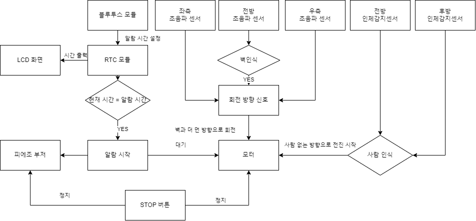

import Stacks from '../../containers/project/Stacks'
import MemberContainer from '../../containers/project/MemberContainer'
import MemberGrid from '../../containers/project/MemberGrid'

임베디드 시스템 설계 및 실험 과목에서 **5인 팀으로 진행한 Term Project**입니다.

기상알람시계의 목적은 사용자가 알람을 듣고 잠에서 깨어나게 하는 것입니다. 하지만 알람을 통해 한 번에 일어나지 못하고 **여러 번의 알람을 통해 일어나는 사람들이 존재**합니다. 저희 팀은 이에 대한 원인이 침대에서의 손쉬운 알람 끄기라고 보았습니다. 이를 해결하기 위해 **알람시계가 움직여 알람을 끄기 어렵게** 하였습니다. 알람시계는 사람을 감지하는 순간 도망가기 시작합니다. 사용자는 알람을 끄기 위해 도망가는 알람을 따라잡아야 하고, 자연스럽게 침대에서 벗어나게 됩니다.

알람은 켜져 있으면 짜증나고, 또한, 끄기가 귀찮아야 합니다. **사람들은 짜증과 귀찮음 사이에서 고민하다 침대에서 벗어나게 될 것입니다.**

임베디드 보드 `STM32F107VCT6`와 `다양한 센서들`을 활용하여 프로젝트를 진행하었습니다. 1000페이지에 달하는 보드에 대한 레퍼런스가 주어졌고, 이를 해석하여 보드의 사용법, 더 나아가 많은 센서들과의 연결을 하였습니다. 또한, `Critical Section`을 통한 신호 전달로 각 센서들의 동작을 `동기화` 할 수 있었습니다.

<Stacks>
  
  
</Stacks>

## 💭️️ 흐름도

## 환경
- IAR Embedded Workbench for Arm 9.30.1
- 개발보드 : `STM32F107VCT6`

## 사용 센서 및 모듈
 - 리얼타임 클럭 모듈 `SZH-EK047`
 - 초음파 거리센서 모듈 `HC-SR04`
 - 인체감지센서모듈 HC-SR501 `SZH-EK052`
 - Bluetooth 모듈 `FB755AC`
 - 알람 경보용 피에조 부저
 - TFT-LCD

<MemberContainer>
  <MemberGrid members={[
    {
      imageSrc: 'https://github.com/jagaldol.png',
      link: 'https://github.com/jagaldol',
      name: '안혜준',
      description: '초음파 거리 센서 모듈 담당'
    },
    {
      imageSrc: 'https://github.com/fkthfvk112.png',
      link: 'https://github.com/fkthfvk112',
      name: '정진성',
      description: 'bluetooth 모듈 담당'
    },
    {
      imageSrc: 'https://github.com/icarus012832.png',
      link: 'https://github.com/icarus012832',
      name: '박진영',
      description: '인체 감지 센서 담당'
    },
    {
      imageSrc: 'https://github.com/limiabc.png',
      link: 'https://github.com/limiabc',
      name: '한병정',
      description: '리얼타임 클럭 모듈 담당'
    },
    {
      imageSrc: 'https://github.com/mia2583.png',
      link: 'https://github.com/mia2583',
      name: '김명서',
      description: '납땜 및 회로 연결 담당'
    },
  ]} />
</MemberContainer>