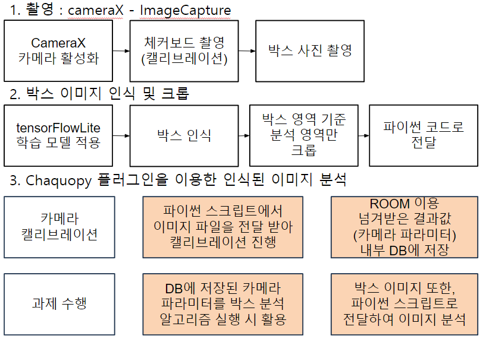
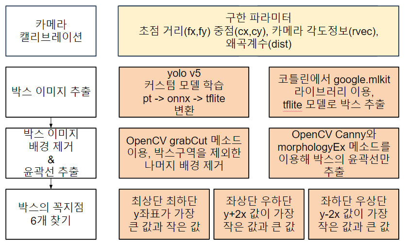

import Stacks from '../../containers/project/Stacks'
import MemberContainer from '../../containers/project/MemberContainer'
import MemberGrid from '../../containers/project/MemberGrid'

**스마트폰 카메라를 통해 박스의 실제 크기(가로, 세로, 높이)를 구할 수 있는 안드로이드 어플리케이션**입니다.

**2023년 CJ 미래기술 챌린지** 에 **스마트폰 활용한 상품 체적 측정** 주제로 출품하였습니다. 오직 스마트폰으로 카메라만을 통해 박스의 실제 크기를 구해야 했습니다. 사진에서 길이 기준으로 잡을 것이 없었던 만큼 카메라의 기본 원리에 입각하여 접근하였습니다.

> 카메라의 초점거리 : 실제 거리 = 이미지 상 박스 크기 : 실제 박스 크기

해당 원리에 의하면 카메라와 박스간의 거리를 구하면 실제 박스 크기를 구할 수 있다는 걸 알 수 있습니다. **아래 수식은 실제 박스 최하단 꼭짓점을 월드 좌표**로 구하는 공식입니다.

> $$
P = C_w + k(p_w - C_w)
$$

이를 사용하기 위해 **카메라의 내부/외부 파라미터**를 구해야했고, **체커보드 패턴을 사용한 카메라 캘리브레이션** 절차를 추가하였습니다.

---

이미지로부터 박스 각 변의 길이를 구하기 위해서는 먼저 박스 이미지를 추출해야 했습니다. **박스 이미지를 학습시킨 모델**을 통해 `Android ML kit`로 **박스 이미지만을 크롭**해내었습니다.

그리고 `OpenCV`를 사용하여 크롭한 박스 이미지에서 **배경제거**를 하였고 **윤곽선을 검출하여 각 꼭짓점을 계산**했습니다. 계산된 꼭짓점을 이용하여 상자의 꼭짓점을 `3D 좌표계로 변환`하였고, **캘리브레이션을 통해 계산된 파라미터를 활용**하여 실제 `월드 좌표계`로 변환하여 **실제 박스의 체적을 도출**해낼 수 있었습니다.

> **2023년 CJ 미래기술 챌린지 본선 진출 출품작**입니다.

<Stacks>
  
  
  
  
  
  
  
</Stacks>

## 어플 구조

## 알고리즘 구조

<MemberContainer>
  <MemberGrid members={[
    {
      imageSrc: 'https://github.com/ssigner.png',
      link: 'https://github.com/ssigner',
      name: '김종훈(팀장)',
      description: '캘리브레이션 / 거리 계산 알고리즘 개발'
    },
    {
      imageSrc: 'https://github.com/jagaldol.png',
      link: 'https://github.com/jagaldol',
      name: '안혜준',
      description: '인공지능 및 꼭짓점 검출 알고리즘 개발'
    },
    {
      imageSrc: 'https://github.com/gogumac.png',
      link: 'https://github.com/gogumac',
      name: '김유빈',
      description: 'ML kit 객체 인식 및 어플 기능 개발'
    },
    {
      imageSrc: 'https://github.com/jihoon5916.png',
      link: 'https://github.com/jihoon5916',
      name: '김지훈',
      description: '알고리즘 개발'
    },
  ]} />
</MemberContainer>