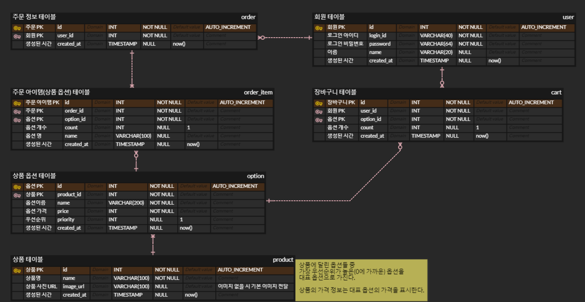

import Stacks from '../../containers/project/Stacks'

카카오 테크 캠퍼스의 2단계 클론 코딩으로 **카카오 쇼핑하기 서비스**를 제작하였습니다.

이전 10주에 걸쳐 1단계의 `Java`, `spring`, `MySQL`을 배우고, 2단계로 6주간의 클론 코딩 프로젝트를 시작하였습니다. 기초로 배웠던 지식들을 간단한 클론코딩 프로젝트를 통해 실제로 활용하는 경험을 할 수 있었습니다. `spring security`, `jwt 인증 필터`, `spring AOP`, `spring data JPA` 등 필수적인 spring boot 서버 개발 도구들을 프로젝트에 적용하며 익힐 수 있었습니다.

  <h2><a href="/files/kakao-shop-api-docs.html">📋 API DOCS 확인하기</a></h2>

  <Stacks>
    
    
    
    
    
  </Stacks>

  ## 🗄️️ ERD

  

