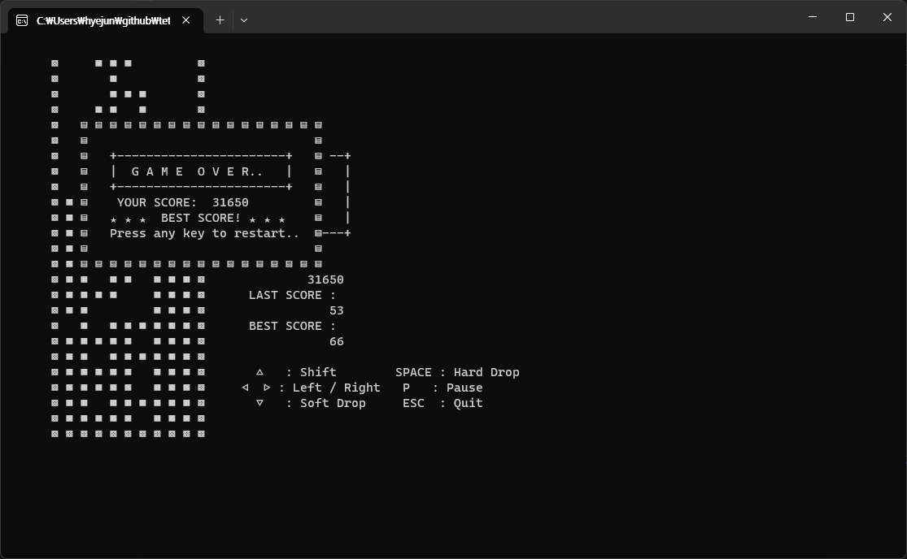

간단한 게임을 만들어 보고 싶어 콘솔로 테트리스를 구현하였습니다. 게임판의 정보는 `배열`로 관리되며, `0.1초`마다 새롭게 그려집니다.

`Windows 11` 환경에서 정상 동작하며 `Visual Studio 2022`로 제작하였습니다.

  ## 💾 다운로드 및 게임 실행

  <a href="/files/tetris.exe" download>게임 다운로드</a>

  ## 🎮 조작키

  | key        | 동작        |
  |:------------:|:-----------:|
  | ↑          | 회전        |
  | ← &nbsp; → | 좌우 이동     |
  | SPACE      | Hard drop |
  | P          | 일시 정지     |
  | ESC        | 종료        |

  ## 게임 화면

  

    
  

  

    
  

  

    
  

